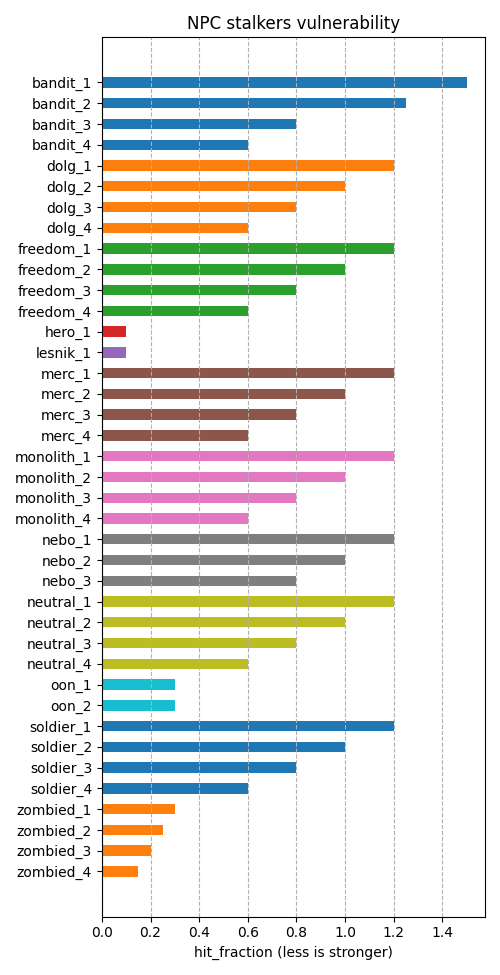
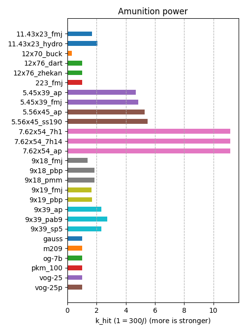

# Real Weapons mod for Clear Sky

Main purposes of this mod: weapons and ammos has real power, calculated from real manufacturer data sheets.

Clear Sky version: **1.5.10**

[Run Clear Sky on Linux](https://github.com/stalker-tools/tools/blob/main/run_cs.md)

## Mod details

* The Actor and NPC are roughly equal at the Master game level. But If you have gameplay problems - set game level to _Novice_ and back to you favorite game level after.
* Weapons and ammos has real power, calculated from real manufacturer data sheets.

## Analysis

At first unpack original _gamedata_ folder:
* Unpack game files to gamedata folder. See [Unpack gamedata](https://github.com/stalker-tools/tools/blob/main/analysis_cs.md) page.
* Copy original gamedata to `gamedata_orig`, for example. It used later to create .patch file.

### Generate NPC and weapons analysis html file
Use [.ltx files analysis tools](https://github.com/stalker-tools/tools)
```sh
python graph_tool.py -f "$HOME/.wine/drive_c/Program Files (x86)/clear_sky/gamedata" --head "NPC and weapons" > NPC_and_weapons.htm
```
Result: file NPC_and_weapons.htm (for example see _media/NPC_and_weapons.htm_ file).

### Ammo parameters graphs analysis

Look at graphs how unrealistic the ammo characteristics looks :astonished: ...
5.45x39 and 5.56x45 ammo power five times less than real !

Real parameters:




Main ammo parameter is power impulse: `k_hit` coefficient, it expressed as `1 = 300 Joules`. `1 Joule = (m * v^2) / 2` SI unit of kinetic energy. So to get bullet kinetic energy we need know bullet speed and bullet mass. To get this manufacturer data sheet files or wiki used.

`Damage = hit_power * k_hit`, see below tactical parameters.

Ammo tactical parameters:
* `k_hit` - bullet power coef
* `k_ap` - bullet ability to break through armor
* `k_dist` - distance coef
* `k_disp` - dispersion coef
* `k_pierce` - armor decrease coef
* `impair` - weapon barrel wear for one shoot
* `buck_shot` - count of bullet parts (buckshot shots)
* `wm_size` - visual size of the bullet hole on the surface
* `k_air_resistance` - air resistance of bullet coef

Weapon tactical parameters:
* `hit_power` - weapon power coef: Novice, Stalker, Veteran, Master
* `hit_impulse` - bullet to aim impulse
* `hit_type` - damage type: fire_wound, explosion
* `ammo_class` - ammo type list
* `fire_distance`, `silencer_fire_distance` - max fire distance
* `fire_dispersion_base` - base angle of dispersion, degrees
* `cam_relax_speed`, `cam_relax_speed_ai` - return speed for player and AI
* `cam_dispersion`, `cam_dispersion_inc` - each shoot dispersion increase, degree; `cam_dispersion` each shot increase
* `cam_dispersion_frac` - barrel up for: `cam_dispersion * cam_dispersion_frac ± cam_dispersion * (1 - cam_dispersion_frac)`
* `cam_max_angle` - max barrel vertical-up angle for shooting recoil
* `cam_max_angle_horz`, `cam_step_angle_horz` - max barrel horizontal angle; `cam_max_angle_horz` each shot increase
* `zoom_cam*` - like `cam_*` but for optical aiming and front sight
* `fire_dispersion_condition_factor` - dispersion increase on max wear, percent
* `misfire_probability` - probability of a misfire on max wear
* `misfire_condition_k` - misfire condition threshold
* `condition_shot_dec` - wear increase for each shot

Common xray game engine parameters:
* `class` - C++ class
* `$prefetch` - preloading queue
* `$spawn`, `$npc` - name and section for level designer; option for level designer
* `min_radius`, `max_radius` - AI: weapon NPC usage distance range
* `ef_main_weapon_type` - 0 pistol, 1 shotgun, 2 assault rifle, 3 rifle, 4 grenade launcher, 5 binocle
* `ef_weapon_type` - weapon subtype: 0 binocle, 1 knife/bolt/rat, zombie, 2 cat/dog/flesh/snork, 3 bloodsucker/chimera/giant/pseudodog,
  4 izlom, 5 pistol, 6 assault rifle, 7 rifle, 8 SVD/SVU/Gauss rifle/PKM machine gun, 9 grenade launcher, 10 grenade,
  11 controller, 12 burer/poltergeist, 13..19 anomaly, teleport
* `default_to_ruck` - false: weapon autoselect on free slot
* `sprint_allowed` - true: can run with weapon
* `control_inertion_factor` - weapon inertion
* `weapon_class` - assault_rifle, sniper_rifle, heavy_weapon (grenade launcher), shotgun
* `holder_range_modifier`, `holder_fov_modifier` - AI: inrease eye_range/eye_fov for NPC for weapon in hands
* `zoom_dof` - depth of field change on front sight aiming
* `reload_dof` - depth of field change on reloading

## Create Real Weapons mod

### Edit .ltx files

Use python tools from **tools** repo to analyze and edit .ltx files. Manufacturer site datasheet (see links) used or wiki. Calculate kinetic energy and set `k_hit` for ammo.

### **Ammo `k_hit` calculations with references:**
Wikipedia used if no datasheet link.

Abbreviations:

APB - armor-piercing bullet

SCB - steel core bullet

HPB - high penetration bullet


* #### 5.45x39

[7N10](http://roe.ru/catalog/sukhoputnye-vosyka/strelkovoe-oruzhie/boepripasy-k-strelkovomu-oruzhiyu/7n10/) HPB
`880 m/s x 3.62 g = 1402 J = 4.67`

7N22 APB
`890 m/s x 3.67 g = 1454 J = 4.85`

_AKS74U_ riffle
`hit_power = 735 m/s x 3.62 g = 978 J / 1402 J = 0.7`

* #### 5.56x45

`890 m/s x 4 g = 1584 J = 5.28`

[RS 101](http://roe.ru/catalog/sukhoputnye-vosyka/strelkovoe-oruzhie/boepripasy-k-strelkovomu-oruzhiyu/rs-101/) HPB
`920 m/s x 3.9 g = 1650 J = 5.5`

* #### 7.62x25

[57-N-134](https://www.kalashnikov.ru/medialibrary/6c0/24_30.pdf)
`440 m/s x 5.5 g = 532 J = 1.78`

* #### 7.62x39

`735 m/s x 7.9 g = 2134 J = 7.1`

* #### 7.62x51

P80/1 (FN Herstal)
`820 m/s x 9.8 g = 3319 J = 11.1`

* #### 7.62x54

[7N1](http://roe.ru/catalog/sukhoputnye-vosyka/strelkovoe-oruzhie/boepripasy-k-strelkovomu-oruzhiyu/7n1/)
`820 m/s x 9.9 g = 3352 J = 11.17`

[7N14](http://roe.ru/catalog/sukhoputnye-vosyka/strelkovoe-oruzhie/boepripasy-k-strelkovomu-oruzhiyu/7n14/) APB
`820 m/s x 9.9 g = 3352 J = 11.17`

* #### 9x18

[57-N-181](https://www.kalashnikov.ru/medialibrary/6c0/24_30.pdf)
`303 m/s x 6.1 g = 280 J = 0.93`

[7N25](http://roe.ru/catalog/sukhoputnye-vosyka/strelkovoe-oruzhie/boepripasy-k-strelkovomu-oruzhiyu/7n25/) APB
`480 m/s x 3.6 g = 415 J = 1.38`

[7N21](http://roe.ru/catalog/sukhoputnye-vosyka/strelkovoe-oruzhie/boepripasy-k-strelkovomu-oruzhiyu/7n21/) SCB
`455 m/s x 5.4 g = 559 J = 1.86`

_PB_ pistol
`hit_power = 290 m/s x 6.1 g = 257 J / 280 J = 0.92`

* #### 9x19

`365 m/s x 7.5 g = 500 J = 1.67`

[7N31](http://roe.ru/catalog/spetsialnye-sredstva/pistolety-pulemety/7n31/?ysclid=lka3r1txjf753431711) APB
`575 m/s x 4.2 g = 694 J = 2.31`

MP5SD (with silencer)
`silencer_hit_power = 285 m/s x 7.45 g = 305 J / 500 J = 0.61`

* #### 9x39

[SP-5](http://roe.ru/catalog/spetsialnye-sredstva/avtomaty2/as/) SCB
`295 m/s x 16 g = 696 J = 2.32`

PAB-9 APB
`310 m/s x 17 g = 817 J = 2.72`

Surprize ! 9x39 is almost half power of 5.45x39. But it still better in buildings - no ricochets.

* #### 11.43x23 / .45 ACP

`260 m/s x 14.9 g = 504 J = 1.68`

Note, `11.43x23 hydro` is not real.

* #### 12x70

[Express Kupra buckshot 6.5 мм 34 g](https://techcrim.ru/?page_id=16396) Copper-plated shot

`430 m/s x 1.26 g = 117 J = 0.39`
`buck_shot = 34 g / 1.26 g = 27`

_rifles_ fire_distance: 35 m (buckshot) `k_dist = 0.7`, 50 m (bullet) `k_dist = 1`.

### Create patch file `real_weapons.patch`:
```sh
diff -bur "$HOME/.wine/drive_c/Program Files (x86)/clear_sky/gamedata_orig" "$HOME/.wine/drive_c/Program Files (x86)/clear_sky/gamedata" > real_weapons.patch
```

To apply patch file `real_weapons.patch` to gamedata folder:
```sh
patch --verbose --directory=./gamedata/ --strip=1 < real_weapons.patch
```

### Create mod zip file
```sh
real_weapons_create_mod_zip.sh
```
